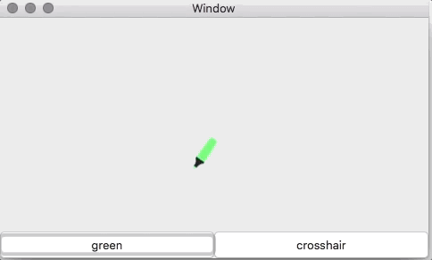

# custom cursor

This is a Minimal Working Example which shows a problem which I have encountered when trying to set a custom cursor in a macOS application.
When a custom cursor is set, after a while (from 0 to 20 seconds) the cursor gets resetted to the usual arrow cursor.

I am currently using macOS 10.13.4, but the first time I wrote a code similar to this I had macOS 10.12 and the problem was still there.

In this GIF you can see that the green cursor is automatically replaced by an arrow (after approximately 10 seconds), and then, after few more seconds, the same happens for the crosshair cursor.

